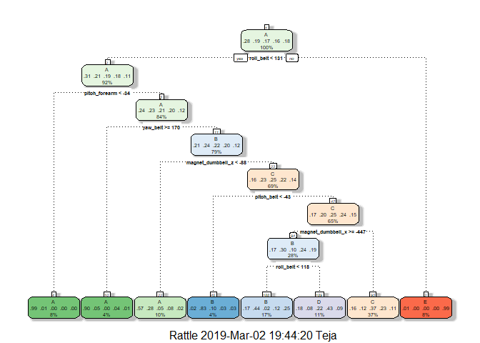
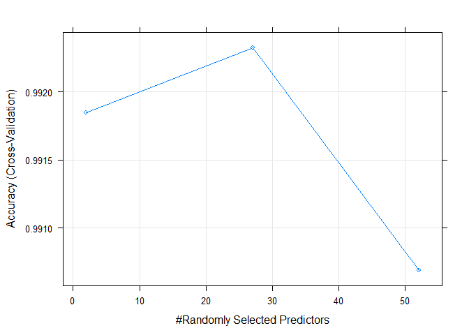

## Background

Using devices such as Jawbone Up, Nike FuelBand, and Fitbit it is now possible to collect a large amount of data about personal activity relatively inexpensively. These type of devices are part of the quantified self movement - a group of enthusiasts who take measurements about themselves regularly to improve their health, to find patterns in their behavior, or because they are tech geeks. One thing that people regularly do is quantify how much of a particular activity they do, but they rarely quantify how well they do it.

In this project, your goal will be to use data from accelerometers on the belt, forearm, arm, and dumbell of 6 participants. They were asked to perform barbell lifts correctly and incorrectly in 5 different ways.

## Libraries


```r
library(caret)
library(rattle)
```

## Loading Data


```r
pmlTrain <- read.csv('pml-training.csv')
pmlTest <- read.csv('pml-testing.csv')
```

The training data set is made of 19622 observations on 160 columns. We can notice that many columns have NA values or blank values on almost every observation. So we will remove them, because they will not produce any information. The first seven columns give information about the people who did the test, and also timestamps. We will not take them in our model.


```r
incolTrain <- which(colSums(is.na(pmlTrain)  | pmlTrain == "") > 
                      dim(pmlTrain)[1]*.9)
incolTest <- which(colSums(is.na(pmlTest)  | pmlTest == "") > 
                     dim(pmlTest)[1]*.9)
pmlTrain2 <- pmlTrain[, -incolTrain]
pmlTrain2 <- pmlTrain2[, -c(1:7)]
pmlTest2 <- pmlTest[, -incolTest]
pmlTest2 <- pmlTest2[, -c(1:7)]
dim(pmlTrain2)
```

```
## [1] 19622    53
```

```r
dim(pmlTest2)
```

```
## [1] 20 53
```

After cleaning, the new training data set has only 53 columns.


```r
set.seed(12345)
intrain <- createDataPartition(pmlTrain2$classe , p=0.75, list = FALSE)
trainData <- pmlTrain2[intrain, ]
testData <- pmlTrain2[-intrain, ]
dim(trainData)
```

```
## [1] 14718    53
```

```r
dim(testData)
```

```
## [1] 4904   53
```

In the following sections, we will test 3 different models :  classification tree,  random forest  gradient boosting method

In order to limit the effects of overfitting, and improve the efficicency of the models, we will use the *cross-validation technique. We will use 5 folds (usually, 5 or 10 can be used, but 10 folds gives higher run times with no significant increase of the accuracy).

## Train with Classification Tree


```r
modelTree <- train(classe~., data = trainData, method = "rpart",
                   trControl = trainControl(method = "cv", number = 5))
fancyRpartPlot(modelTree$finalModel)
```

<!-- -->

```r
prediction <- predict(modelTree, newdata = testData)
conMat <- confusionMatrix(testData$classe, prediction)
conMat$table
```

```
##           Reference
## Prediction   A   B   C   D   E
##          A 870 159 273  88   5
##          B 162 530 214  43   0
##          C  29  36 674 116   0
##          D  46 136 429 193   0
##          E  16 221 224  51 389
```

```r
conMat$overall
```

```
##       Accuracy          Kappa  AccuracyLower  AccuracyUpper   AccuracyNull 
##   5.415987e-01   4.244770e-01   5.275299e-01   5.556179e-01   3.699021e-01 
## AccuracyPValue  McnemarPValue 
##  1.365836e-131  7.169181e-223
```

We can notice that the accuracy of this first model is very low (about 54%). This means that the outcome class will not be predicted very well by the other predictors.

## Train with Random Forest


```r
modelRF <- train(classe~., data = trainData, method = "rf", 
                 trControl = trainControl(method = "cv", number = 5), 
                 verbose=FALSE)
prediction <- predict(modelRF, newdata = testData)
conMat <- confusionMatrix(testData$classe, prediction)
conMat$table
```

```
##           Reference
## Prediction    A    B    C    D    E
##          A 1394    1    0    0    0
##          B    6  939    4    0    0
##          C    0    2  849    4    0
##          D    0    0   10  794    0
##          E    0    0    2    5  894
```

```r
conMat$overall
```

```
##       Accuracy          Kappa  AccuracyLower  AccuracyUpper   AccuracyNull 
##      0.9930669      0.9912298      0.9903250      0.9951940      0.2854812 
## AccuracyPValue  McnemarPValue 
##      0.0000000            NaN
```

```r
plot(modelRF)
```

<!-- -->

With random forest, we reach an accuracy of 99.3% using cross-validation with 5 steps. This is very good. But let's see what we can expect with Gradient boosting.

We can also notice that the optimal number of predictors, i.e. the number of predictors giving the highest accuracy, is 27. There is no significal increase of the accuracy with 2 predictors and 27, but the slope decreases more with more than 27 predictors (even if the accuracy is still very good). The fact that not all the accuracy is worse with all the available predictors lets us suggest that there may be some dependencies between them.

At last, using more than about 30 trees does not reduce the error significantly

## Train with Gradient Boosting Model


```r
modelGbm <- train(classe~., data = trainData, method = "gbm",
                  trControl = trainControl(method = "cv", number = 5),
                  verbose=FALSE)
prediction <- predict(modelGbm, newdata = testData)
conMat <- confusionMatrix(testData$classe, prediction)
conMat$table
```

```
##           Reference
## Prediction    A    B    C    D    E
##          A 1378   14    3    0    0
##          B   39  874   34    1    1
##          C    0   20  824   10    1
##          D    0    1   21  776    6
##          E    3    7    8   16  867
```

```r
conMat$overall
```

```
##       Accuracy          Kappa  AccuracyLower  AccuracyUpper   AccuracyNull 
##      0.9622757      0.9522608      0.9565588      0.9674334      0.2895595 
## AccuracyPValue  McnemarPValue 
##      0.0000000            NaN
```

Precision with 5 folds is around 95%.

## Conclusion

This shows that the random forest model is the best one. We will then use it to predict the values of classe for the test data set.


```r
prediction <- predict(modelRF, newdata = pmlTest2)
prediction
```

```
##  [1] B A B A A E D B A A B C B A E E A B B B
## Levels: A B C D E
```


